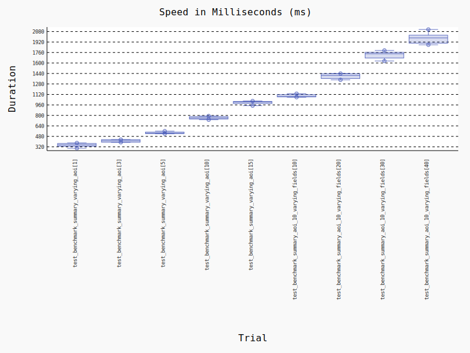

## Database API Deliverable Acceptance Test

### Description of Deliverable

This deliverable includes the implementation of an API, providing access to the space2stats database. The API supports querying the space2stats data by location. The API is a FastAPI application that accesses the underlying PostgreSQL database. The API documentation is accessible [here](https://space2stats.ds.io/docs), and example usage can be found in the notebook [here](https://github.com/worldbank/DECAT_Space2Stats/blob/main/notebooks/space2stats_api_demo.ipynb).

The acceptance test outlined below verifies that the API meets agreed-upon specifications.

### API Configuration

The listed environment variables must be configured to run the API:
```bash
PGHOST=
PGPORT=
PGDATABASE=
PGUSER=
PGPASSWORD=
PGTABLENAME=
S3_BUCKET_NAME=
```

> The S3 bucket name is where the responses will be temporarily stored for requests when the data exceeds AWS Lambda's 6MB threshold. The bucket must be accessible to the AWS profile used to run the API.

### API Setup

The deployed API is accessible at: https://space2stats.ds.io

You may also run the API locally: 
```bash
AWS_PROFILE=space2stats uvicorn src.space2stats.app:app --reload 
```

> Ensure your AWS profile is configured. You may configure it with `aws configure` or by setting your profile ([AWS' docs](https://docs.aws.amazon.com/cli/v1/userguide/cli-configure-files.html)).


### Testing the API Endpoints

1. **Health Check Endpoint**

   Verify that the API is up and running by hitting the `/health` endpoint:

   \```bash
   curl -X GET "http://localhost:8000/health"
   \```

   Expected response:
   \```json
   {
     "status": "ok"
   }
   \```

2. **Query Available Fields**

Test querying the available fields using the `/fields` endpoint. Here are specific examples: 

- `curl`:
```bash
curl -X GET "http://localhost:8000/fields"
```

- Python:
```python
FIELDS_ENDPOINT = f"{BASE_URL}/fields"
response = requests.get(FIELDS_ENDPOINT)
if response.status_code != 200:
    raise Exception(f"Failed to get fields: {response.text}")

available_fields = response.json()
print("Available Fields:", available_fields)
```

- R:
```r
req <- request(base_url) |>
  req_url_path_append("fields")  
resp <- req |> req_perform()

if (resp_status(resp) != 200) {
    stop("Failed to get fields: ", resp_body_string(resp))
}
available_fields <- resp |> resp_body_json()
```

The expected response is a JSON object of the available fields:
```json
Available Fields: ['sum_pop_2020', 'sum_pop_f_0_2020', 'sum_pop_f_10_2020', 'sum_pop_f_15_2020', 'sum_pop_f_1_2020', 'sum_pop_f_20_2020', 'sum_pop_f_25_2020', 'sum_pop_f_30_2020', 'sum_pop_f_35_2020', 'sum_pop_f_40_2020', 'sum_pop_f_45_2020', 'sum_pop_f_50_2020', 'sum_pop_f_55_2020', 'sum_pop_f_5_2020', 'sum_pop_f_60_2020', 'sum_pop_f_65_2020', 'sum_pop_f_70_2020', 'sum_pop_f_75_2020', 'sum_pop_f_80_2020', 'sum_pop_m_0_2020', 'sum_pop_m_10_2020', 'sum_pop_m_15_2020', 'sum_pop_m_1_2020', 'sum_pop_m_20_2020', 'sum_pop_m_25_2020', 'sum_pop_m_30_2020', 'sum_pop_m_35_2020', 'sum_pop_m_40_2020', 'sum_pop_m_45_2020', 'sum_pop_m_50_2020', 'sum_pop_m_55_2020', 'sum_pop_m_5_2020', 'sum_pop_m_60_2020', 'sum_pop_m_65_2020', 'sum_pop_m_70_2020', 'sum_pop_m_75_2020', 'sum_pop_m_80_2020', 'sum_pop_m_2020', 'sum_pop_f_2020']
```


3. **Summary Data**

   This section demonstrates how to request summary data for a specific area of interest (AOI) using the `/summary` endpoint. 


- `curl`:
```bash
curl -X POST "http://localhost:8000/summary" \
-H "Content-Type: application/json" \
-d '{
      "aoi": "aoi_value",
      "spatial_join_method": "centroid",
      "fields": ["sum_pop_2020"],
      "geometry": "point"
    }'
```

- Python:

```python
# Define the Request Payload
request_payload = {
    "aoi": aoi,
    "spatial_join_method": "centroid",
    "fields": ["sum_pop_2020"], 
    "geometry": "point"
}

# Get Summary Data
response = requests.post(SUMMARY_ENDPOINT, json=request_payload)
if response.status_code != 200:
    raise Exception(f"Failed to get summary: {response.text}")

summary_data = response.json()
df = pd.DataFrame(summary_data)
```

- R:
```r
request_payload <- list(
    aoi = aoi,
    spatial_join_method = "centroid",
    fields = list("sum_pop_2020"),
    geometry = "point"
)

# Set up the base URL and create the request
req <- request(base_url) |>
  req_url_path_append("summary") |>
  req_body_json(request_payload)

# Perform the request and get the response
resp <- req |> req_perform()

# Turn response into a data frame
summary_data <- resp |> resp_body_string() |> fromJSON(flatten = TRUE)
```

The expected response is a JSON containing the hexagon ID and the requested fields:
```text
hex_id [...] sum_pop_2020  sum_pop_f_0_2020  
0      866a4a48fffffff [...] 399.860905  4.405487   
1      866a4a497ffffff [...] 582.555159  6.418330   
2      866a4a49fffffff [...] 749.911237  8.262184   
3      866a4a4d7ffffff [...] 863.888290  11.218388   
4      866a5820fffffff [...] 525.085147  5.785151   
```

### Performance Benchmarks

We’ve implemented performance benchmarking to test the API’s efficiency under various scenarios. The benchmarks ensure the API can handle querying fields and summary data effectively. Key areas tested include:

- `/fields` endpoint: Verify all available fields can be accessed promptly.
- `/summary` endpoint: Test with varying AOI sizes (different numbers of hexagons) and fields (ensuring all fields can be queried).

These benchmarks provide insights into response times, scalability, and performance under concurrent requests. You may run the benchmarks with:

```curl
python -m pytest tests/test_benchmark.py 
```

or to generate the histogram graph:
```curl
python -m pytest tests/test_benchmark.py --benchmark-histogram=my_benchmark_results
```



The `test_benchmark_varying_aoi[n]` is a benchmark test where `n` is the size of the area in degrees. `test_benchmark_varying_aoi[10]` covers an area that extends beyond then entire country of Kenya. 

The `test_benchmark_aoi_10_varying_fields[n]` is a benchmark test where `n` is the number of fields returned. The  `aoi_10` refers to the size of 10 degrees used for the AOI for each test. In terms of key differences to observe, when the amount of data transfer exceeds Lambda's 6MB of data to transfert, we redirect the requests to S3. The performance remains very similar considering the extra amount of data transferred. Even the largest requests returns in less than 2 seconds.

### Automated Testing

We’ve implemented unit tests for various API functionalities in the `space2stats_api/src/tests` directory. These tests ensure the API works as expected, including proper response for all supported endpoints such as `/fields` and `/summary`.

Automated tests cover:

- Verifying the correct access to all available fields.
- Ensuring accurate data retrieval through the /summary endpoint with different AOIs and field combinations.

Run the tests to validate API behavior under different scenarios and ensure robustness.

### Final Acceptance

The deliverable will be accepted once the API successfully meets all the functional and performance criteria outlined and once they have been reviewed. 