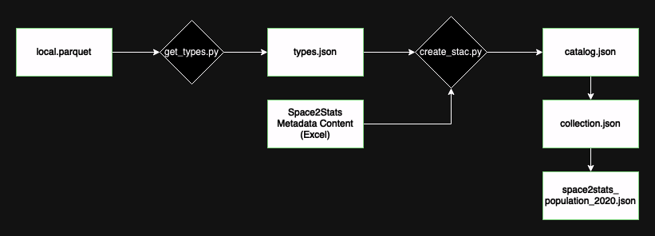

## Space2Stats Metadata

### Generating Preliminary STAC Catalog, Collection, and Item Files

Follow these steps to create the initial STAC metadata:

1. **Update the Parquet File Path**:
   - Open `get_types.py` and update the `parquet_file` variable in the `main()` function to point to your local Parquet file.

2. **Run Metadata Scripts**:
   - Navigate to the `METADATA` sub-directory and execute the following commands in order:
     1. `python get_types.py`
     2. `python create_stac.py`

   - **Note**: The `get_types.py` script reads the Parquet file from the following directory:  
     `space2stats_api/src/local.parquet`

3. **Reference Workflow**:
   - Here’s a workflow diagram for creating initial STAC metadata:

   

---

### Adding New STAC Item Files

To add new STAC Items, follow these steps:

1. **Update Paths and Metadata**:
   - In `get_types.py`, update the `parquet_file` variable in the `main()` function to point to your local Parquet file.
   - In `link_new_item.py`, set the variables in the section labeled **Paths and Metadata Setup** within the `main()` function.

2. **Update Metadata File**:
   - Add a new entry in the **Source** tab of the `METADATA/Space2Stats Metadata Content.xlsx` file if it doesn’t already exist.

3. **Run Metadata Scripts**:
   - Navigate to the `METADATA` sub-directory and execute the following commands in order:
     1. `python get_types.py`
     2. `python link_new_items.py`
