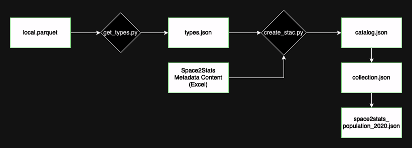

# Space2Stats Metadata

## Generating Preliminary STAC Catalog, Collection, and Item Files

Follow these steps to create the initial STAC metadata:

1. **Update the Parquet File Path**:
   - Open `get_types.py` and update the `parquet_file` variable in the `main()` function to point to your local Parquet file.
> [!NOTE]  
> By default, the script reads the Parquet file from the following directory: `space2stats_api/src/space2stats.parquet`

2. **Run Metadata Scripts**:
   - Navigate to the `METADATA` sub-directory and execute the following commands in order:
     1. `python get_types.py`
     2. `python create_stac.py`

### Reference Workflow:
   - Here’s a workflow diagram for creating initial STAC metadata:

   

---

## Adding a New STAC Item

To add a new STAC Item, update the CSV metadata files in the `metadata_content/` folder, and pass your new Parquet dataset to the `link_new_item.py` script.

1. **Update Metadata CSVs**:
   - In `metadata_content/Space2Stats_Metadata_Feature_Catalog.csv`, add a row for each new variable in your dataset with columns: `variable`, `description`, `nodata`, and `item`.
   - Create an item id for the new set of variables, for example *world_pop* or *nighttime_lights*.
   - In `metadata_content/Space2Stats_Metadata_Sources.csv`, add a new row for the item with its name, description, citation, method, resolution, and optional start/end dates.
> [!IMPORTANT]
> Make sure that the `Item` column in **Sources** corresponds to the same item id you used in the **Feature Catalog**. This is used to link variables to their source metadata.

2. **Run *link_new_item.py* script**:
   - Navigate to the `METADATA` sub-directory and execute the following command:
   - `python link_new_item.py -i <path_to_new_parquet_dataset>`
   - Where `-i` or `--input_parquet` is the path to the new Parquet dataset.